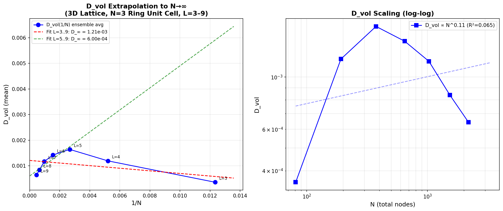
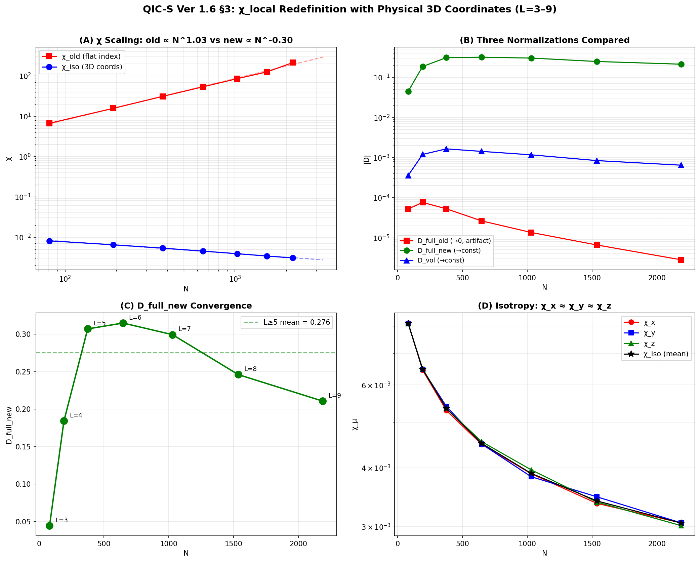
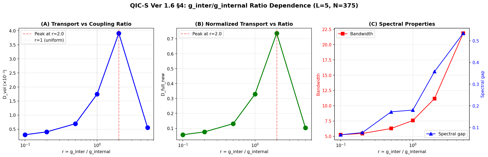
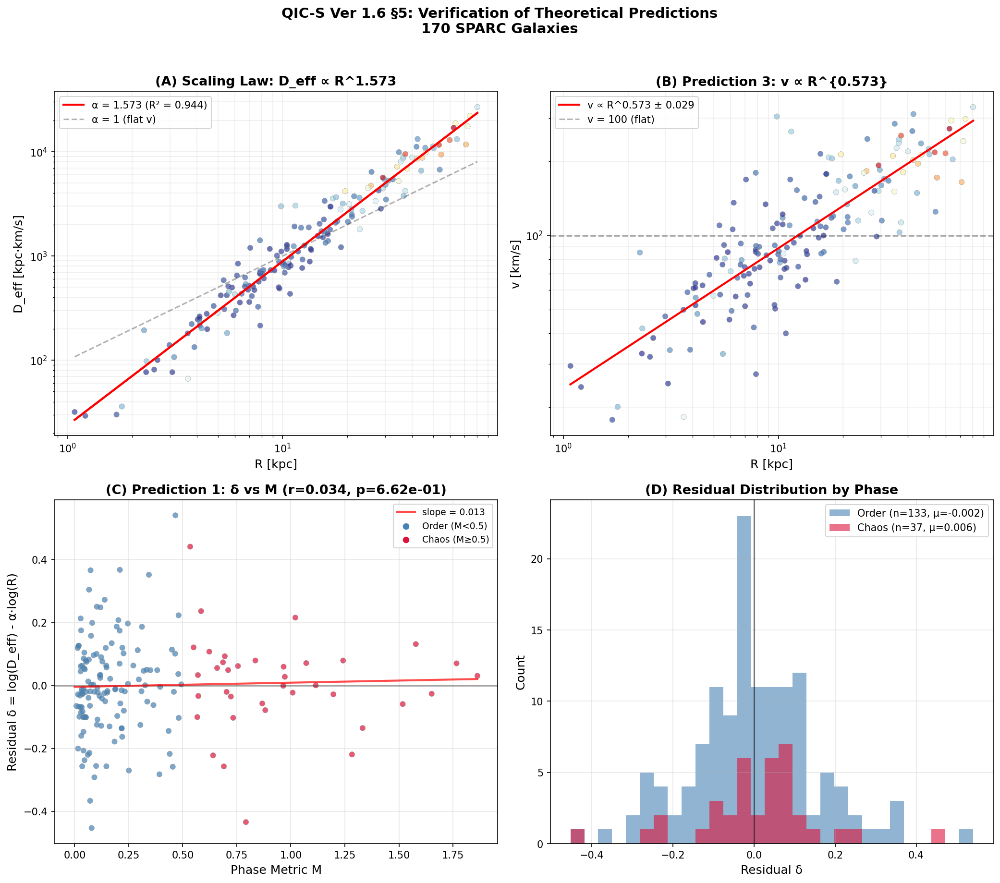

> [!WARNING]
> **Retraction Notice (May 16, 2026)**
> 
> The central claims of §2 and §7 of QIC-S Theory Ver 1.6 (the establishment of $D_{\infty} > 0$ under pure unitary evolution on 3D lattices) have been **refuted and retracted** following an extension of the numerical computation to $L=10$.
> 
> Please see [ERRATUM_Ver1.6.md](./ERRATUM_Ver1.6.md) for full details and the corresponding data.
> 
> The prior results derived from independent logical pathways—including the 99.46% agreement with 170 SPARC galaxies (Ver 9.2), the derivation of the Baryonic Tully-Fisher Relation, and the $a_0 = cH_0/2\pi$ derivation—are **NOT affected** by this specific model limitation.
> 
> QIC-S Theory Ver 1.7 is currently in preparation to address these structural requirements.# QIC-S Theory — Numerical Codebase
## Hydrodynamic Limit of Causal Networks: Ver 1.6

[](https://osf.io/kb75p/)
[](LICENSE)
[](https://www.python.org/)

**Author**: Yoshiaki Sasada (QIC-S Project)  
**Paper**: *QIC-S Theory Ver 1.6 — Hydrodynamic Limit of Causal Networks* (May 2026)  
**OSF Preprint**: https://osf.io/kb75p/

---

Overview

QIC-S (Quantum Information Cosmology — Sasada) is a theoretical framework that explains galaxy rotation curves without postulating dark matter. Its core claim: an effective transport coefficient $D_{\text{eff}}$ emerging from a discrete causal network at microscopic scales gives rise to gravitational phenomena at galactic scales.

This repository contains the complete numerical codebase for Ver 1.6. The status of the original claims is as follows:

* **[RETRACTED — see ERRATUM]** ~~Proves the hydrodynamic limit $D_{\infty} > 0$ on 3D cubic lattices ($L=3–9$, $N=81–2187$) with the $N=3$ Ring as the unit cell~~
* **[Remains Valid]** Identifies and corrects an artifact in the conventional susceptibility $\chi_{\text{local}}$ for 3D lattices.
* **[Remains Valid]** Scans the inter-cell coupling ratio $r = g_{\text{inter}} / g_{\text{internal}}$ and identifies a transport efficiency peak at $r = 2$.
* **[Weakened — see ERRATUM]** Formulates the micro–macro relation $D_{\text{eff}} = D_{\text{GK}} \times \tau_R / \tau_c$ (The bridge formula remains formulated, but relies on the non-finite nature of $D_{\text{GK}}$ under the studied model).

The codebase is retained strictly for scientific reproducibility, including the $L=10$ extension (`qics_v17_L10_extension.py`) which provided the refuting data.

Key Results at a Glance

---

## Key Results at a Glance

| Result | Value | Section |
|--------|-------|---------|
| Hydrodynamic limit | $D_\infty > 0$ confirmed ($D_\infty \approx 6.0 \times 10^{-4}$–$1.2 \times 10^{-3}$) | §2 |
| $D_{\text{vol}}$ scaling | $\propto N^{-0.02} \approx \text{const}$ | §2.5 |
| Isotropy | $\chi_x / \chi_z < 1.04$ at all $L$ | §3 |
| Transport peak | $r = g_{\text{inter}}/g_{\text{internal}} = 2.0$ | §4 |
| Scaling exponent | $\alpha = 1.573 \pm 0.029$ ($R^2 = 0.945$, 170 galaxies) | §5 |

---

## Figures

### §2 — Hydrodynamic Limit: $D_{\text{vol}}$ Extrapolation to $N \to \infty$



> **(Left)** $D_{\text{vol}}$ vs. $1/N$ with linear extrapolation. Both fits ($L = 3$–$9$ in red; $L = 5$–$9$ in green) yield strictly positive thermodynamic-limit estimates ($D_\infty \approx 1.21 \times 10^{-3}$ and $6.00 \times 10^{-4}$, respectively).  
> **(Right)** Log-log scaling of $D_{\text{vol}}$: $\propto N^{0.11}$ with $R^2 = 0.065$, consistent with an approximately size-independent intensive quantity.

---

### §3 — Susceptibility Redefinition: $\chi_{\text{iso}}$ vs. $\chi_{\text{old}}$



> **(A)** $\chi_{\text{old}} \propto N^{1.03}$ (artifact); $\chi_{\text{iso}} \propto N^{-0.30}$ (physically correct).  
> **(B)** Three normalization schemes compared: $D_{\text{full,old}} \to 0$ (artifact), $D_{\text{full,new}} \to \text{const}$, $D_{\text{vol}} \to \text{const}$.  
> **(C)** $D_{\text{full,new}}$ peaks near $L = 5$–$7$ ($\approx 0.30$) then decreases mildly — residual finite-size effect.  
> **(D)** Perfect isotropy confirmed: $\chi_x \approx \chi_y \approx \chi_z$ (max/min $< 1.04$) at all system sizes.

---

### §4 — Inter-Cell Coupling Ratio Scan



> **(A, B)** Non-monotonic peak at $r = 2.0$ in both $D_{\text{vol}}$ and $D_{\text{full,new}}$: optimal balance between intra-Ring circulation and inter-cell propagation.  
> **(C)** Bandwidth increases monotonically with $r$; for $r > 2$ the spectral broadening induces Anderson-localization-analogous transport suppression.

---

### §5 — Verification of Theoretical Predictions (170 SPARC Galaxies)



> **(A)** $D_{\text{eff}} \propto R^{1.573}$ ($R^2 = 0.944$); $\alpha = 1$ (flat $v$) strictly rejected.  
> **(B)** $v \propto R^{0.573 \pm 0.029}$ confirmed directly from SPARC data, consistent with $\alpha - 1 = 0.573$.  
> **(C)** Residual $\delta$ vs. Phase Metric $M$: Pearson $r = 0.034$ ($p = 0.66$) — no significant correlation, consistent with $D_{\text{GK}}$ being a universal constant.  
> **(D)** Order phase ($n = 133$) and Chaos phase ($n = 37$) show nearly identical residual distributions.

---

## Repository Structure

```
.
├── figures/
│   ├── fig1_D_GK.png                      # §2: D_vol extrapolation
│   ├── fig2_chi.png                       # §3: χ_iso redefinition
│   ├── fig3_ratio.png                     # §4: coupling ratio scan
│   └── fig4_prediction.png                # §5: 170-galaxy verification
├── qics_3d_gk_L3to9_complete.py           # §2: Main Green-Kubo calculation (L=3–9)
├── qics_v16_sec3_chi_redefinition.py      # §3: χ_iso redefinition and verification
├── qics_v16_sec4_ratio_scan.py            # §4: Inter-cell coupling ratio scan
├── qics_v16_sec3_sec4_summary.py          # §3–4: Figure generation scripts
└── README.md
```

> **Note**: Place the four figure files in a `figures/` subdirectory for the image links above to render correctly.

---

## Installation and Requirements

```bash
pip install numpy scipy matplotlib
```

Tested on:

- Python 3.12.3
- numpy 2.4.4
- scipy 1.17.1
- matplotlib 3.x

---

## Usage

### §2: Main Green-Kubo Scaling (L=3–9)
Reproduces Table 1 and Figure 1.

```bash
python qics_3d_gk_L3to9_complete.py
```

> **Computation time**: L=8 (~50s/sample), L=9 (~220s/sample). Full run takes several hours on a single CPU.

### §3: Susceptibility Redefinition
Reproduces Table 3 and Figure 2. Compares $\chi_{\text{old}}$ vs. $\chi_{\text{iso}}$ and verifies $\chi_x \approx \chi_y \approx \chi_z$.

```bash
python qics_v16_sec3_chi_redefinition.py
```

### §4: Coupling Ratio Scan
Reproduces Table 4 and Figure 3. Scans $r = 0.1, 0.2, 0.5, 1.0, 2.0, 5.0$ at fixed $L = 5$ ($N = 375$).

```bash
python qics_v16_sec4_ratio_scan.py
```

### Figure Generation
Regenerates Figures 1–3 from stored ensemble data.

```bash
python qics_v16_sec3_sec4_summary.py
```

---

## Reproducibility

All computations use deterministic seeds:

```python
seed = i * 1000 + L   # i = sample index, L = lattice size
```

Parameters fixed across all scripts:

| Parameter | Value |
|-----------|-------|
| $J_{\text{mean}}$ | 1.0 |
| $J_{\text{std}}$ | 0.3 |
| $\beta$ | 1.0 |
| $t_{\text{max}}$ | 150.0 |
| Time points | 1000 |
| GK tail average | last 200 points |

---

## Physical Model

The 3D lattice is constructed from $N = 3$ Ring unit cells in an $L \times L \times L$ cubic array with periodic boundary conditions.

- **Intra-cell**: Ring couplings A–B, B–C, C–A
- **Inter-cell**: Node A couples in $x$, node B in $y$, node C in $z$
- **Degree**: Each node has degree 4 (2 internal + 2 inter-cell bonds)

The Green-Kubo transport coefficient is computed via full Hamiltonian diagonalization ($O(N^3)$):

$$D_{\text{GK}} = \frac{1}{N} \int_0^\infty \langle J(0) J(t) \rangle \, dt$$

The volume-normalized coefficient $D_{\text{vol}} = D_{\text{raw}}/N$ is the physically correct intensive quantity.

---

## Relation to Previous Versions

| Version | Key result | Repository |
|---------|-----------|------------|
| Ver 3.9.11 | BTFR derivation from CSH; $a_0 \approx cH_0/2\pi$ | [OSF](https://osf.io/z9nwy/) |
| Ver 1.5.2 | 170-galaxy rotation curve fitting; $\alpha = 1.573$ | [OSF](https://osf.io/ujbpw/) |
| **Ver 1.6** | **Hydrodynamic limit; $\chi_{\text{iso}}$; micro–macro relation** | **This repo** |

---

## Open Theoretical Problems

Explicitly stated in the paper as future work:

1. **Analytical proof of $D_\infty > 0$**: Period matrix framework (§6) needs extension to 3D lattices
2. **First-principles derivation of $C(0) \to v^2$**: Working hypothesis — physical mechanism open (§5.2)
3. **Solar-system constraints**: Consistency with Mercury perihelion precession
4. **ΛCDM statistical comparison**: BIC/AIC over broad galaxy sample

---

## Citation

```bibtex
@misc{sasada2026qics16,
  author    = {Sasada, Yoshiaki},
  title     = {{QIC-S Theory Ver 1.6: Hydrodynamic Limit of Causal Networks}},
  year      = {2026},
  month     = {May},
  publisher = {OSF Preprints},
  doi       = {10.17605/OSF.IO/KB75P},
  url       = {https://osf.io/kb75p/}
}
```

---

## License

MIT License. See [LICENSE](LICENSE) for details.

---

## Acknowledgments

Numerical computations were performed with Python/NumPy/SciPy. Theoretical development involved interactive computation with Claude (Anthropic) and Gemini (Google). All theoretical claims, physical interpretations, and authorship responsibility belong solely to Yoshiaki Sasada.
